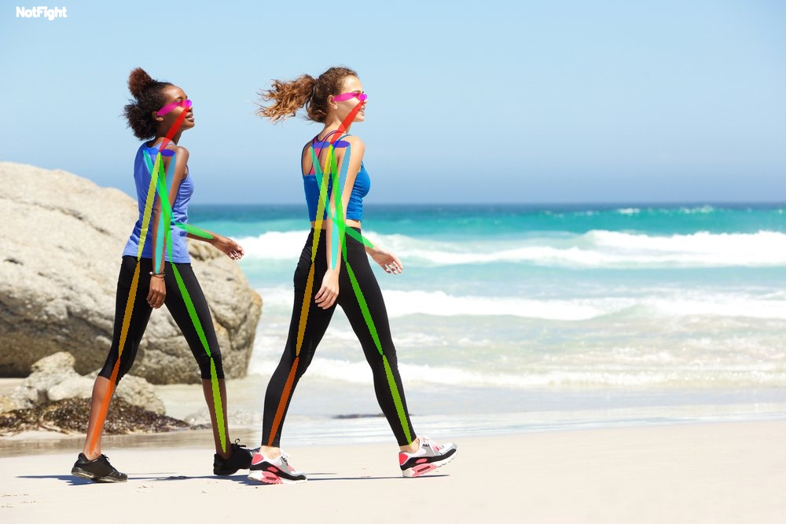
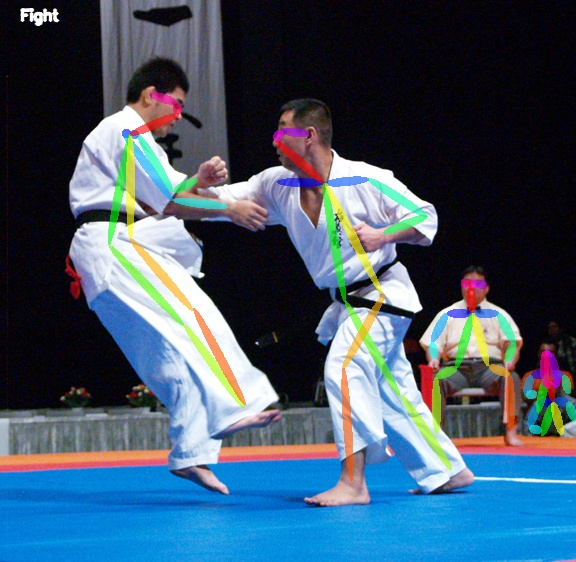

# Pose Classifier using DNN
This is an extended version of  [Realtime Multi-Person Pose Estimation](https://github.com/ZheC/Realtime_Multi-Person_Pose_Estimation) project  

## Introduction

1:-  Using Keras MultiPerson Pose Estimation Repository to get the pose estimation for the people in the scene . Alternate Library such as OpenPose and PoseNet were system contrained to setup and hence were not used for pose estimation. This keras repository ouput was just returning an image with pose drawn over it. Code was added to the repository to return pose points for the people in the image and grouped together in an array. 

2:- The modified library would return pose points for people who are significantly visible on the scene .

3:- The returned pose points was then preprocessed to remove a) People who are not significantly visible on the scene ie the number of pose edges are less than 6. b) The images were not taken into train dataset if after completing the step a , number of people were less than 2. 

4:- The pose points were then normalized with respect to the image size, as different image has different scale and the pose points varied according to them. 

5:-  The final vector that was created was contactination of vectors of two individual of size 136. 

6:- The training data set was created using only two people in a scene.(Due to limited training data)

7:- During testing , if the number of people in the scene increased more than 2 , then it has a voting mechanism that would count the interaction between every two people and upvote or downvote the scene fight flag. If the vote for scene fight flag is true the scene would be classified as Fight Scene and vice versa.

## Result




## Files to Look For 

1. **train.py** :- The following steps are executed while running this file:- 

    a) The script loads all the file present in samples folder. It run the pose estimation model to get the pose of the people in the image. 

    b) The pose is then filtered to remove people those people that are not much visible in the scene.The pose points are also normalized. 

    c) Using the pose of two people in the frame, the model creates a 136 size 1-d array for training. 

    d) The train data for the entire dataset is then saved into a pickle file to be used during training. 

2. **classify.py** :- The following steps are executed in this script:- 

   a) The Model is created using create_model() function 

   b) The model is ran through crossvalidation to check for the performance of the model on the dataset

   c) The model is fitted to the dataset and saved in a pickle file

   d) The model is then tested on test images at sample_image/TestImages folder.The result is then saved with tag of wether they are fighting or not fighting


## Testing Steps

```python
from classify import ActionClassifier
import cv2
cal  = ActionClassifier()
image  = cv2.imread(<<image_path>>)
result_tag,result_image = cal.classify(image)
```

## Recreate result:

1. Download pose estimation pretrained model :- https://www.dropbox.com/s/llpxd14is7gyj0z/model.h5

2. Run train.py

3. Run classify.py

## Related repository
- CVPR'16, [Convolutional Pose Machines](https://github.com/shihenw/convolutional-pose-machines-release).
- CVPR'17, [Realtime Multi-Person Pose Estimation](https://github.com/ZheC/Realtime_Multi-Person_Pose_Estimation).

- keras_Realtime_Multi-Person_Pose_Estimation,[keras_Realtime_Multi-Person_Pose_Estimation](https://github.com/michalfaber/keras_Realtime_Multi-Person_Pose_Estimation)